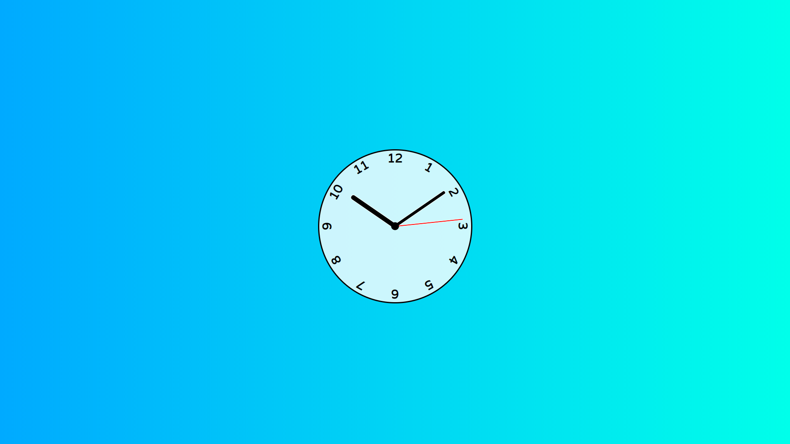
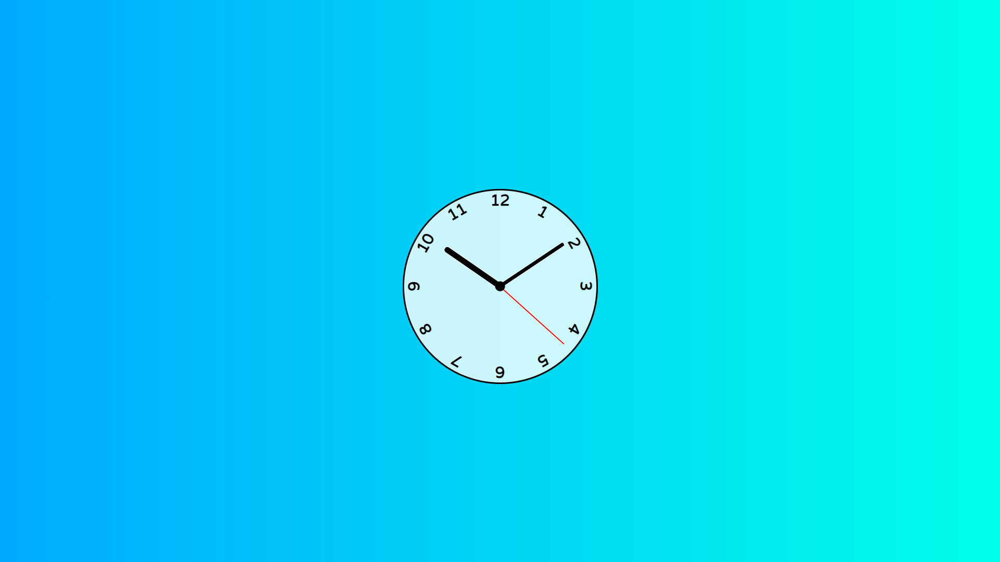
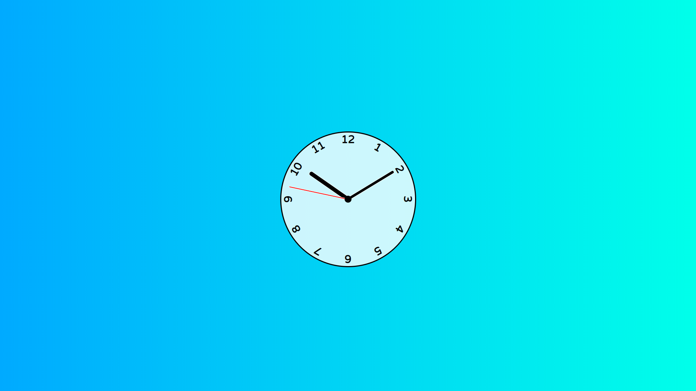

# clock-tutorial-javascript-WDS

This great CSS and Javascript clock [tutorial](https://www.youtube.com/watch?v=Ki0XXrlKlHY&list=PLZlA0Gpn_vH8DWL14Wud_m8NeNNbYKOkj&index=13) from [Web Dev Simplified](https://www.youtube.com/channel/UCFbNIlppjAuEX4znoulh0Cw) is easy and informative. None of the code is mine. Here a few screenshots of the clock (notice that the second hand moves). To truly appreciate the clock, follow the link below the screenshots.

My rendering of this tutorial is [published on GitHub](https://martucazpo.github.io/clock-tutorial-javascript-WDS/), try it out!